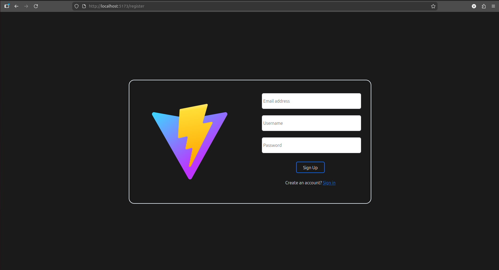
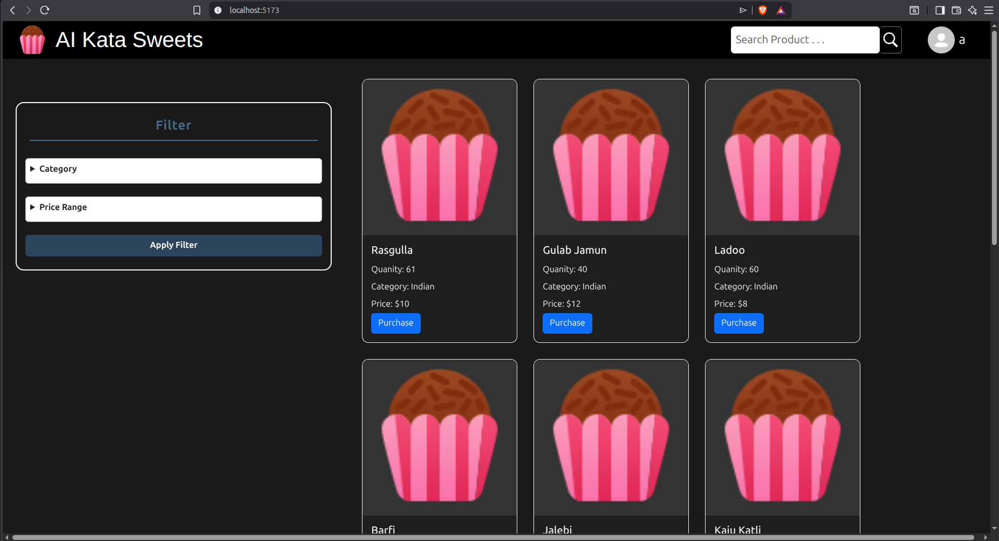
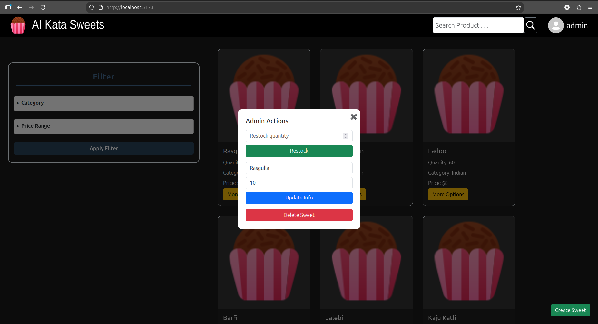

# Sweet Shop Management System

A full-stack Sweet Shop Management System built using the MERN stack.  
The application allows users to browse and purchase sweets, while admin users can manage inventory by adding, updating, deleting, and restocking sweets. The project follows clean coding practices and a test-driven development approach for backend APIs.

---

## Features

### Authentication
- User registration and login using JWT (stored in HTTP-only cookies)
- Role based access control (Admin and User)

### Sweets Management
- View all available sweets
- Search sweets by name, category, or price range
- Purchase sweets (quantity decreases)
- Admin only:
  - Add new sweets
  - Update sweet details
  - Delete sweets
  - Restock sweets

### Frontend
- Built with React and custom hooks
- Responsive UI using Bootstrap and custom SCSS modules
- Role based UI actions for admin and normal users
- Toast notifications for action's feedback

### Backend
- RESTful APIs using Node.js and Express
- MongoDB with Mongoose for data persistence
- Proper middleware based authentication and authorization
- Seeder for initial sweet data

### Testing
- Jest and Supertest for backend API testing
- Tests written following TDD principles
- Coverage for auth, sweets CRUD, purchase, and restock flows

---

## Tech Stack

### Frontend
- React
- React Router
- Bootstrap
- SCSS Modules
- React Toastify

### Backend
- Node.js
- Express.js
- MongoDB
- Mongoose
- JWT
- bcrypt

### Testing
- Jest
- Supertest

---

## 📂 Project Structure

```

server/
├── controllers
├── models
├── routes
├── middleware
├── services
├── tests
├── src
└── server.js

client/ 
├── public/
├── src/
│   ├── components/
│   ├── hooks/
│   ├── context/
│   ├── pages/
│   ├── App.css
│   ├── App.jsx
│   └── Main.jsx
└── index.html
```

---


## Installation

1. Clone the repository:
   ```bash
   git clone https://github.com/KunalVChoudhary/AI-Kata-Sweet-Shop-Management-System.git
   cd AI-Kata-Sweet-Shop-Management-System
   ```

2. Install dependencies:
   ```bash
   cd client && npm install
   cd ../server && npm install
   ```

3. Add environment variables in server app (`.env`):
   ```
   MONGO_URI=your_mongo_connection_string
   MONGODB_URI_TEST=your_test_mongo_connection_string
   CLIENT_URL=your_react_app_url
   JWT_SECRET=your_jwt_secret
   COOKIE_PARSER_SECRET_KEY=your_cookie_parser_secret
   PORT=your_port_number
   ```

4. Add environment variables in client app (`.env`):
   ```
   VITE_API_URL=your_express_server_url
   ```

5. Start the AI-Kata-Sweet-Shop-Management-System app:
   ```bash
   npm start
   ```

---

##  My AI Usage

### AI Tools Used
- ChatGPT

### How I Used AI
I used ChatGPT as a supporting tool during development to speed up the overall building process due to time constraints, while still making sure I understood and implemented the core logic myself.


Initially, I did not have hands-on experience with backend testing using Jest and Supertest. I first spent time understanding how testing works in practice, including how to structure test files, set up test databases, and test protected routes. After understanding the basics, I used ChatGPT to generate 1–2 initial test case drafts to validate my approach. Once the approach was clear, I implemented the remaining test cases myself and later used ChatGPT mainly to check, verify, and make small improvements to the code.


Most of the backend logic, including authentication, authorization, CRUD APIs, and inventory flows, was implemented by me manually. I occasionally used AI assistance during debugging, for small boilerplate sections, and to make minor improvements to the code.


On the frontend side, the overall layout and core logic were implemented by me. To save time due to assignment deadlines, I used ChatGPT for boilerplate code, styling help, few JSX snippets and debugging, and then refined everything manually.


I also used AI assistance to get suggestions for clean and meaningful Git commit messages to maintain a clear and professional commit history.

I also used ChatGPT to draft the initial structure and layout of this README file, after which I edited and refined the content manually to accurately reflect my work and learning process.


### Reflection on AI Usage

Using AI during this project had a positive impact on my overall workflow, especially under time constraints. It helped me move faster through repetitive or setup-heavy tasks, such as drafting boilerplate code, structuring tests, and organizing files, which allowed me to spend more time on core logic, debugging, and understanding system behavior.

Rather than replacing my problem-solving process, AI acted as a productivity and learning aid. I made sure to first think through the solution myself and then used AI mainly to verify my approach, identify possible improvements, or catch small mistakes. This helped me gain more confidence in my implementation and also improved code quality.

Overall, AI enabled me to maintain momentum throughout the project while still ensuring that I fully understood and owned the final solution. It complemented my development process without becoming a dependency, and I am comfortable explaining and defending every part of the codebase.

---

## Screenshots / Preview

### Login and Register page



### Home dashboard with sweets list



### Admin actions (Add, Update, Delete, Restock)



---

# ✍️ Author

**Kunal Vijay Choudhary**

* GitHub: [@KunalVChoudhary](https://github.com/KunalVChoudhary)
* Email: [imkunalvchoudhary@gmail.com](mailto:imkunalvchoudhary@gmail.com)
* LinkedIn: [kunal-vijayshree-choudhary](https://www.linkedin.com/in/kunal-vijayshree-choudhary)

---

*Thank U!*